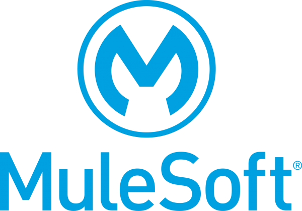

## Hi 👋, I'm a software developer
<!--
#### Now

- ✨ Contributing to [chkware](https://github.com/chkware/cli);
- :fire: Interested in DevOps and Cloud engineering;
- :calendar: Looking for contributing to python based open source projects 
-->
#### Bio

<!-- - ⚙️ I use daily: `.py`, `.js`, `.yml`, `.sh` -->
<!-- - 🌍 I'm mostly active within the **Python Community** -->
- 🌱 Learning all about **Mulesoft, Architecture, Integration**
- 💬 Ping me about **Mulesoft**, **RestAPIs**
<!-- - 📫 Reach me: [twitter.com/sudiptob2](https://twitter.com/sudiptob2) -->
<!-- - 📝 Checkout my [Resume](files/resume.pdf). -->

#### All of my projects
- [Convert json to raml dataType](https://jonathanfiss.github.io/convert-json-to-raml-datatype/)

#### My Current Stack

  

#### Development Stuffs:

<b>⚡ Github Stats</b>

      

<!-- #### Recent Activity

<b> &#9749; Latest Medium Blogs</b>

<a target="_blank" href="https://github-readme-medium-recent-article.vercel.app/medium/@sudiptob2/0">

 -->

#### Connect With Me

<!--   -->
 
<!--  -->
<!--  -->
<!--  -->

<!--
**jonathanfiss/jonathanfiss** is a ✨ _special_ ✨ repository because its `README.md` (this file) appears on your GitHub profile.

Here are some ideas to get you started:

- 🔭 I’m currently working on ...
- 🌱 I’m currently learning ...
- 👯 I’m looking to collaborate on ...
- 🤔 I’m looking for help with ...
- 💬 Ask me about ...
- 📫 How to reach me: ...
- 😄 Pronouns: ...
- ⚡ Fun fact: ...
-->
